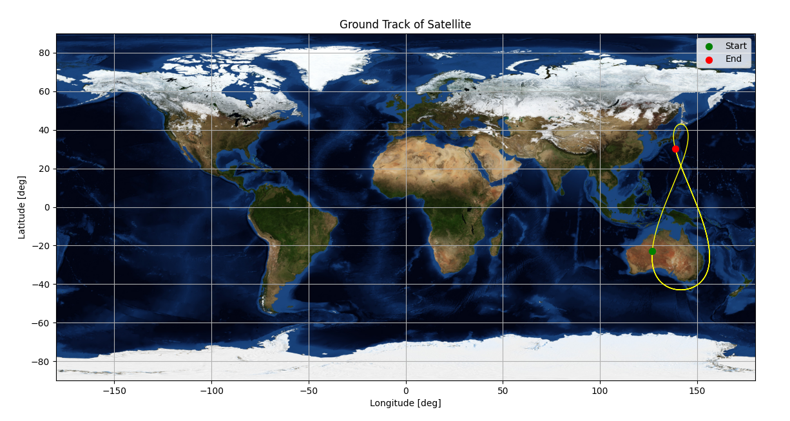
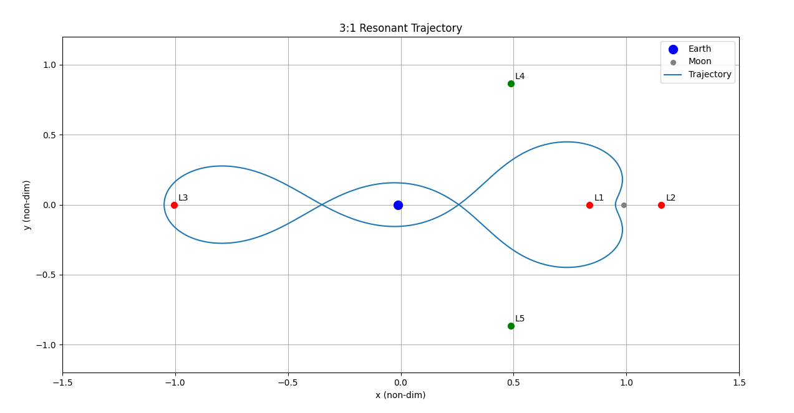
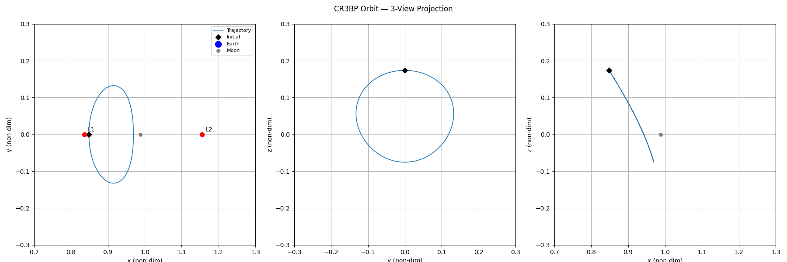

# astrotools

A Python toolkit for astrodynamics — orbital propagation, coordinate transformations, and circular restricted three-body problem (CR3BP) analysis.

> **Status:** Work in progress. APIs and module layout may change.

---

## Features

- **Two-body propagation (R2BP)**, with optional J2 perturbation
- **CR3BP dynamics** — equations of motion, Jacobi constant, Lagrange/libration points
- **Numerical integrators** — 4th-order Yoshida symplectic, Dormand-Prince 8(5,3) (DOP853)
- **Differential correction** — state transition matrix (STM) propagation and planar/halo single-shooting
- **Epoch & frame utilities** — Julian date, Greenwich sidereal time, ECI → ECEF transforms
- **Plotting** — ground tracks, CR3BP rotating-frame trajectories, and 3-view (XY/YZ/XZ) projections for non-planar orbits

---

## Installation

```bash
git clone https://github.com/kkayleon/astrotools.git
cd astrotools
pip install -e .
```

Dependencies: `numpy`, `scipy`, `matplotlib`

---

## Project structure

```
astrotools/
├── constants.py                         # Physical/gravitational constants (Earth, Moon)
├── epoch.py                             # Julian date, GST, ECI->ECEF
├── plotting.py                          # Ground track & CR3BP orbit plots
├── points.py                            # Lagrange/libration point solver
├── stability.py                         # STM propagation, planar/halo single-shooting correction
├── dynamics/
│   ├── twobody.py                       # 2BP acceleration, orbital elements <-> state vector
│   ├── j2.py                            # 2BP + J2 perturbation
│   └── cr3bp.py                         # CR3BP acceleration, Jacobi constant
├── integrators/
│   ├── yoshida4.py                      # Symplectic integrator
│   └── dopr853.py                       # DOP853 (via scipy)
├── trajectory/
│   ├── trajectory.py                    # R2BP propagation wrapper
│   └── cr3bp_trajectory.py              # CR3BP propagation wrapper
└── examples/
    ├── R2BP_leo_sso.py                  # LEO sun-synchronous orbit + ground track
    ├── R2BP_molniya.py                  # Molniya orbit + ground track
    ├── R2BP_qzss_tundra.py              # QZSS Tundra orbit + ground track
    ├── CR3BP_L4.py                      # Perturbed L4 trajectory
    ├── CR3BP_2to1_resonant.py           # 2:1 resonant orbit
    ├── CR3BP_3to1_resonant.py           # 3:1 resonant orbit
    ├── CR3BP_L1_lyapunov.py             # L1 Lyapunov orbit
    ├── CR3BP_shooting_L1_lyapunov.py    # Single-shooting correction for L1 Lyapunov orbit
    └── CR3BP_shooting_halo.py           # Single-shooting correction for an L1 halo orbit
```

---

## Example
### QZSS Tundra orbit

```python
# Example: QZSS Tundra orbit

from astrotools.dynamics.twobody import oe_to_rv
from astrotools.trajectory.trajectory import trajectory
from astrotools.constants import mu_Earth
from astrotools.epoch import UTCtoJ0, GST, JD, latLongECEF
from astrotools.plotting import groundTrack
import numpy as np
import matplotlib.pyplot as plt
cos, sin, pi, sqrt = np.cos, np.sin, np.pi, np.sqrt

# Orbit parameters
a = 42164
e = 0.075 
i = np.radians(43.0)
raan = np.radians(195.0)
argp = np.radians(270.0)
theta = np.radians(305.0)

# Epoch initialization
date = np.array([12, 26, 2009])
timeUTC = np.array([12, 0, 0])

# Setup trajectory propagation for a single orbit w/ 10000 steps
n = 10000
T = 1.5 * (2*pi/sqrt(mu_Earth)*a**1.5)
dt = T/n

# Initial state vector
r0, v0 = oe_to_rv(a, e, i, raan, argp, theta, mu_Earth)

# Propagate trajectory
solver = 'yoshida4'
traj = trajectory(r0, v0, n, dt, perturbation=False, solverType=solver)

# Sidereal time parameters
J0 = UTCtoJ0(date)
julian_date = JD(timeUTC, J0)
theta_G = GST(J0, timeUTC)

# Latitude/Longitude
lat, long = latLongECEF(traj, theta_G)
startingLatitude = np.degrees(np.arcsin(r0[2]/np.linalg.norm(r0)))                      # Calculation based
startingLongitude = np.degrees(np.arctan2(r0[1], r0[0])) - np.rad2deg(theta_G) % 360    # Calculation based
finalLatitude = lat[-1]                                                                 # Final element based
finalLongitude = long[-1]                                                               # Final element based
if startingLongitude < 0: startingLongitude += 360
elif startingLongitude > 180: startingLongitude -= 360
else: pass
if finalLongitude < -180: finalLongitude += 360
elif finalLongitude > 180: finalLongitude -= 360
else: pass

# Output
print(f"-----------------------------------------------------------------")
print(f"Solver type:                         {solver}"), print(f"")
print(f"Semi-major axis (a):                 {a:.3f} km")
print(f"Orbital period (T):                  {T:.3f} seconds"), print(f"")
print(f"Initial epoch:                       {date[0]:02d}/{date[1]:02d}/{date[2]:02d} {timeUTC[0]:02d}:{timeUTC[1]:02d}:{timeUTC[2]:02d} UTC")
print(f"Julian date at epoch:                {julian_date}")
print(f"Greenwich sidereal time (epoch):     {np.rad2deg(theta_G):.3f} deg")
print(f"Starting latitude:                   {startingLatitude:.3f} deg")
print(f"Starting longitude:                  {startingLongitude:.3f} deg")
print(f"Final latitude:                      {finalLatitude:.3f} deg")
print(f"Final longitude:                     {finalLongitude:.3f} deg")
print(f"-----------------------------------------------------------------")
groundTrack(traj,theta_G)
plt.show()

```
### Output
```
-----------------------------------------------------------------
Solver type:                         yoshida4

Semi-major axis (a):                 42164.000 km
Orbital period (T):                  129245.356 seconds

Initial epoch:                       12/26/2009 12:00:00 UTC
Julian date at epoch:                2455192.0
Greenwich sidereal time (epoch):     275.117 deg
Starting latitude:                   -23.028 deg
Starting longitude:                  127.000 deg
Final latitude:                      30.363 deg
Final longitude:                     138.806 deg
-----------------------------------------------------------------
```

### Plotting (Ground Track)



### CR3BP 3:1 Resonant Orbit
```python
# Example: Circular restricted 3-body dynamics for a 3:1 resonant orbit
# Reference: arxiv.org/pdf/2311.10252
# 3:1 Resonant orbit initial conditions from Appendix B, Table B3

from astrotools.dynamics.cr3bp import jacobi_constant, pi1, pi2
from astrotools.trajectory import cr3bp_trajectory
from astrotools.points import l_points
from astrotools.plotting import cr3bp_orbit2d
import matplotlib.pyplot as plt
import numpy as np
cos, sin, sqrt = np.cos, np.sin, np.sqrt

# Initial conditions
r0 = np.array([0.13603399956670137, 0.0, 0.0])
v0 = np.array([0.0, 3.202418276067991, 0.0])

# Propagate trajectory
T = 6.45        # Nondimensional period
n = 1000
dt = T/n
trajectory = cr3bp_trajectory.trajectory(r0, v0, n, dt)

# Jacobi constant along trajectory
jacobi_constants = np.array([jacobi_constant(state[:3], state[3:6]) for state in trajectory])

# Lagrange/Libration points from points.py
libration_points = l_points()

# Output
print(f"")
print(f"-----------------------------------------------------------------"), print(f"")
for i, name in enumerate(['L1', 'L2', 'L3', 'L4', 'L5']):
    print(f"{name}: [{libration_points[i][0]:.6f}, {libration_points[i][1]:.6f}, {libration_points[i][2]:.6f}]")
print(f"Jacobi constant: {jacobi_constants[0]:.6f}"), print(f"")
print(f"-----------------------------------------------------------------"), print(f"")

# Plotting trajectory in rotating frame
cr3bp_orbit2d(trajectory)
plt.show()
```

### Output
```
-----------------------------------------------------------------

L1: [0.836915, 0.000000, 0.000000]
L2: [1.155682, 0.000000, 0.000000]
L3: [-1.005063, 0.000000, 0.000000]
L4: [0.487849, 0.866025, 0.000000]
L5: [0.487849, -0.866025, 0.000000]
Jacobi constant: -1.362611

-----------------------------------------------------------------
```

### Plotting (barycentered-rotating frame)



### CR3BP L1 halo orbit (single shooting)

This example applies the event-based halo corrector to an Earth–Moon CR3BP initial guess. The corrector varies the initial `x` and `vy` components until the trajectory reaches an `y = 0` crossing with `vx = vz = 0` [5].

```python
# Example: Single Shooting method for halo orbit

from astrotools.stability import single_shoot_halo, propagate_stm
from astrotools.plotting import cr3bp_orbit_3view
import numpy as np
import matplotlib.pyplot as plt

# Initial conditions (Table 7 "Target", https://arxiv.org/pdf/2605.07529)
r0 = np.array([0.85, 0.0, 0.173890])
v0 = np.array([0.0, 0.262114, 0.0])
state0 = np.concatenate([r0, v0])

# Single shoot method call
state0_corr, statef, Phi_T, k, tf = single_shoot_halo(state0, -1, 7)
if state0_corr is None:
    print("Newton's method did not converge for the initial condition")
else:
    print(f"Converged in {k} iterations")
    print(f"Corrected initial state: {state0_corr}")

    # Define step/step sizes
    n = 2000
    dt = 2*tf/n

    # Full trajectory propagation
    traj, __ = propagate_stm(state0_corr[:3], state0_corr[3:], n, dt)

    # 3-view plot (Match w/ Fig. 9 "Target" trajectory)
    cr3bp_orbit_3view(traj, bounds_xy=[0.7, 1.3, -0.3, 0.3], bounds_z=[-0.3, 0.3])
    plt.show()
```
 
### Output
```
Converged in 3 iterations
Corrected initial state: [0.84871017 0.         0.17389    0.         0.26350093 0.        ]
```
 
### Plotting (3-view: XY / YZ / XZ)
 
`cr3bp_orbit_3view` propagates the corrected initial state forward over a full period (`2*tf`) and projects the resulting trajectory into all three coordinate planes, with the Earth and Moon annotated in the XY and XZ panels and the libration points annotated in the XY panel.
 



See `astrotools/examples/` for other full runnable example scripts.

---

## Roadmap

- [ ] Patched-conic / transfer trajectory tools

---

## References

[1] Koon, W.S., Lo, M.W., Marsden, J.E., Ross, S.D. (2011). *Dynamical Systems, the Three-Body Problem and Space Mission Design*. https://www.cds.caltech.edu/~marsden/volume/missiondesign/KoLoMaRo_DMissionBook_2011-04-25.pdf

[2] Curtis, H.D. (2021). *Orbital Mechanics for Engineering Students*. 4th ed. Butterworth-Heinemann.

[3] Patel, M., Shimane, Y., Lee, H.W., Ho, K. (2023). *Cislunar Satellite Constellation Design Via Integer Linear Programming*. https://arxiv.org/abs/2311.10252

[4] Yoshida, H. (1990). "Construction of higher order symplectic integrators." *Physics Letters A*, 150(5–7), 262–268.

[5] Fujiwara, M., & Ozaki, N. (2026). *Stochastic Differential Dynamic Programming for Trajectory Optimization under Partial Observability*. arXiv:2605.07529. https://arxiv.org/abs/2605.07529
